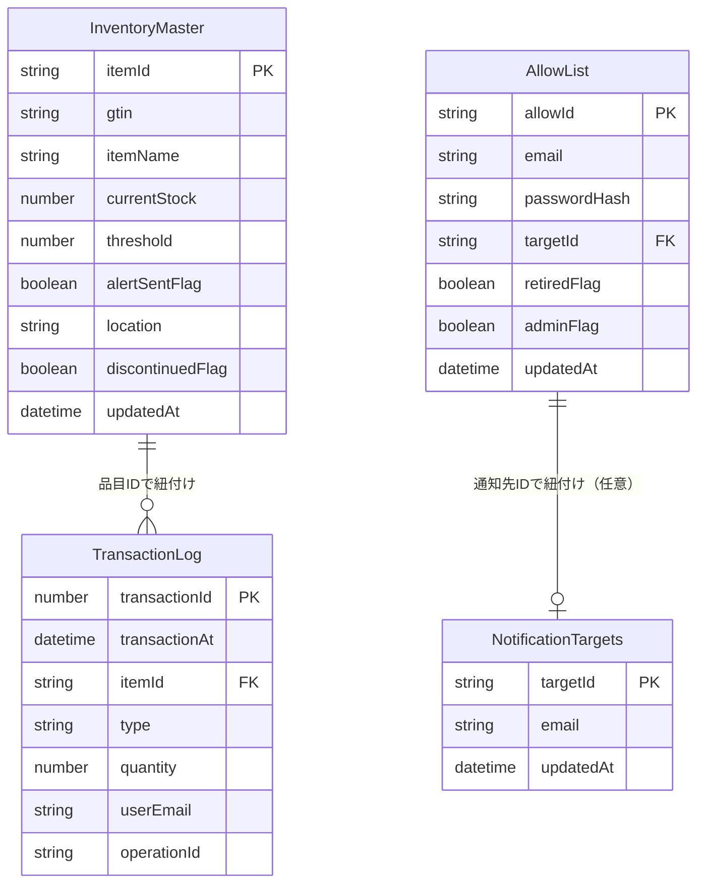

# データベース設計

- 対象システム : 整備部品在庫管理システムv2
- 本書の位置付け : データベース（Googleスプレッドシート）の詳細設計
- 対象 : 要件定義書 7章のデータ設計を、実装可能な列定義まで落とし込んだもの
- 実体 : Googleスプレッドシートを本番DBとして使用する
  - スプレッドシートIDは `.env` の `GOOGLE_SPREADSHEET_ID` に設定し、`nuxt.config.ts` の `runtimeConfig` 経由で読み取る（リポジトリには含めない。本番は Secret Manager に格納。[overview.md](overview.md) 2.2）
  - スプレッドシートへの読み書きはデータアクセス層（`src/server/utils/sheets.ts`）が `@googleapis/sheets`（Sheets API v4）経由で行い、ロジック層・API層から直接呼ばない（[overview.md](overview.md) 3.1）
- 対象外 : 排他ロック（`locks/`）、時差更新の蓄積データ（`pending/`）、通知マージ対象（`pending/alerts/`）は Cloud Storage 上の JSON であり本書では扱わない。データ形状は [overview.md](overview.md) 6.1 / 6.2 / 4.4、フローは [sequence.md](sequence.md) 2.3 / 2.6 を参照

シート名はA1にヘッダー行を持つ想定とする。

- **日時項目の規約** : `updatedAt` / `transactionAt` などの日時は、すべて **UTC の ISO8601 文字列**（例 `2026-09-10T04:15:30Z`）で保存する。画面表示時に JST へ変換する。GCS 上の蓄積データの `occurredAt` / `detectedAt` も同じ規約とする（時系列の比較・名前順ソートの一貫性のため）。
- **ID の採番規則**（`allowId`・`operationId` を除きロジック層で採番。採番を伴う書き込み＝`POST /api/scan` の新規登録・`POST /api/notification-targets`・`TransactionLog` 追記は `locks/inventory.lock` を取得してから行うため衝突しない。[overview.md](overview.md) 6.1）:
  | ID | 形式 | 採番方法 |
  |---|---|---|
  | `itemId`（全品目共通） | `ITM-` ＋ 6桁ゼロ埋め（`ITM-000001`〜`ITM-999999`） | A列を読み、`^ITM-(\d{6})$` に一致する行の最大値 +1。登録経路（D-03 バーコード / D-04 自社発行）を問わず同じ規則 |
  | `gtin`（メーカー品のみ、任意項目） | GTIN-14（14桁数字） | 読み取りコードから正規化（採番しない。[overview.md](overview.md) 4.5）。`itemId` とは別項目 |
  | `transactionId` | 数値の連番（1 から。桁揃えなし） | A列の最大値 +1 |
  | `targetId` | `TAR-` ＋ 3桁ゼロ埋め（`TAR-001`〜`TAR-999`） | `NotificationTargets` A列を読み、`^TAR-(\d{3})$` の最大値 +1 |
  | `allowId` | 任意（初回登録時に人手で採番。例 `U001`） | スプレッドシート直接編集（要件3-1） |
  | `operationId` | UUID v4 | ランダム生成 |

---

## 1. 在庫マスタシート（`InventoryMaster`）

| 列 | 項目名(フィールド名) | 型 | 必須 | 備考 |
|---|---|---|---|---|
| A | 品目ID(itemId) | 文字列 | ○ | 一意。`ITM-` ＋6桁ゼロ埋め（`ITM-000123`）。登録経路（D-03 バーコード / D-04 自社発行）によらず `POST /api/scan` の登録経路がロック区間内で採番する（冒頭「ID の採番規則」） |
| B | GTIN(gtin) | 文字列 | 任意 | メーカー添付バーコード（JAN / GS1 DataMatrix）から登録した場合のみ設定するGTIN-14（例 `04901234567894`）。自社発行QRのみで登録した品目は空欄。読み取りコードから品目を検索する際のキー（要件定義FR-12、[overview.md](overview.md) 4.5節参照）。一意（重複登録防止） |
| C | 品目名(itemName) | 文字列 | ○ | |
| D | 現在在庫数(currentStock) | 数値 | ○ | 0以上 |
| E | 閾値(threshold) | 数値 | ○ | 0以上 |
| F | アラート送信済みフラグ(alertSentFlag) | 真偽値(TRUE/FALSE) | ○ | 初期値FALSE |
| G | 保管場所(location) | 文字列 | 任意 | |
| H | 廃番フラグ(discontinuedFlag) | 真偽値 | ○ | 初期値FALSE。管理者のみ変更可(FR-11) |
| I | 更新年月日(updatedAt) | 日時 | ○ | 在庫マスタ更新の都度、ロジック層でセット |

## 2. 入出庫履歴シート（`TransactionLog`）

| 列 | 項目名(フィールド名) | 型 | 必須 | 備考 |
|---|---|---|---|---|
| A | 取引ID(transactionId) | 数値 | ○ | 一意（PK）。`TRN-`＋6桁ゼロ埋め（`TRN-000123`）。ロジック層で採番する（A列の最大値+1。当シートのA列は取引IDのみ・追記専用なので最大値＝最新。ロック区間内で追記するため衝突しない。[sequence.md](sequence.md) 2.1） |
| B | 入出庫日時(transactionAt) | 日時 | ○ | サーバー側で付与（UTC ISO8601）。通常はロジック層での処理時刻。時差更新（[sequence.md](sequence.md) 2.6）で後追い登録する場合は退避時の発生時刻（`occurredAt`）を用いる |
| C | 品目ID(itemId) | 文字列 | ○ | 在庫マスタと紐付け |
| D | 種別(type) | 文字列 | ○ | `IN` または `OUT` |
| E | 数量(quantity) | 数値 | ○ | 1以上。出庫は現在在庫数を超えない（超える要求は `INSUFFICIENT_STOCK` で拒否。記録数量＝実際の増減量、[overview.md](overview.md) 5章） |
| F | ユーザ識別(userEmail) | 文字列 | ○ | ログイン中のメールアドレス。時差更新時は退避時の `operator` |
| G | 操作ID(operationId) | 文字列 | ○ | API層で採番するUUID。時差更新（[sequence.md](sequence.md) 2.6）の冪等な後追い適用に用いる（同一 `operationId` の行が既にあれば適用済みとみなし、履歴は追記しない） |

> 追記専用（INSERT ONLY） \
> 既存行の更新・削除は行わない設計とする（監査ログ性を担保）

## 3. 通知先設定シート（`NotificationTargets`）

| 列 | 項目名(フィールド名) | 型 | 必須 | 備考 |
|---|---|---|---|---|
| A | 通知先ID(targetId) | 文字列 | ○ | 一意。`TAR-` ＋3桁ゼロ埋め（`TAR-001`〜）。`POST /api/notification-targets` がロック区間内で採番（冒頭「ID の採番規則」） |
| B | 通知先メールアドレス(email) | 文字列 | ○ | メール形式・重複不可 |
| C | 更新年月日(updatedAt) | 日時 | ○ | |

> 品目ごとの紐付けは行わず、登録済み全アドレスへ一律通知
> `AllowList.targetId`（D列）が値を持つ行は、その `targetId` を持つ本シートの行と対応する（アラート受信者。管理者判定には用いない。管理者は `AllowList.adminFlag`（F列）で判定）。D列は `POST`/`DELETE /api/notification-targets` がメールアドレス一致で自動的に反映・クリアするため、削除可否には影響しない（4章参照）

## 4. 許可リストシート（`AllowList`）

| 列 | 項目名(フィールド名) | 型 | 必須 | 備考 |
|---|---|---|---|---|
| A | 許可ID(allowId) | 文字列 | ○ | 一意 |
| B | 許可メールアドレス(email) | 文字列 | ○ | ログイン照合キー |
| C | パスワード(passwordHash) | 文字列 | ○ | bcryptjsによる暗号化済み文字列（要件定義7.4、FR-01）。平文は保存しない（＝画面での平文表示は不可）。本人は `PUT /api/user/password`、管理者は `PUT /api/users/{allowId}/password` で再ハッシュ更新（FR-13、3-10）。初回登録は `npm run hash-password` で生成したハッシュを直接記入（要件3-1） |
| D | 通知先ID(targetId) | 文字列 | 条件付 | 同一メールアドレスが `NotificationTargets` に登録されている場合の `targetId`（`TAR-NNN`）。`POST /api/notification-targets` 追加時・`DELETE /api/notification-targets` 削除時にメールアドレス一致でロジック層が自動的に反映・クリアする（手動編集は不要）。空白可。管理者判定には用いない（通知先への紐付け専用。削除可否にも影響しない） |
| E | 退職フラグ(retiredFlag) | 真偽値 | ○ | trueの場合ログイン拒否 |
| F | 管理者フラグ(adminFlag) | 真偽値 | ○ | trueの場合、管理者ユーザと判断 |
| G | 更新年月日(updatedAt) | 日時 | ○ | |

> 「管理者級の整備士」の判定は、F列（管理者フラグ）で行う \
> （要件定義2章「権限による操作はDBの直接編集」に対応。管理者はスプレッドシート直接編集権限を別途Google側の共有設定で付与する） \

## 5. シート間の参照関係

