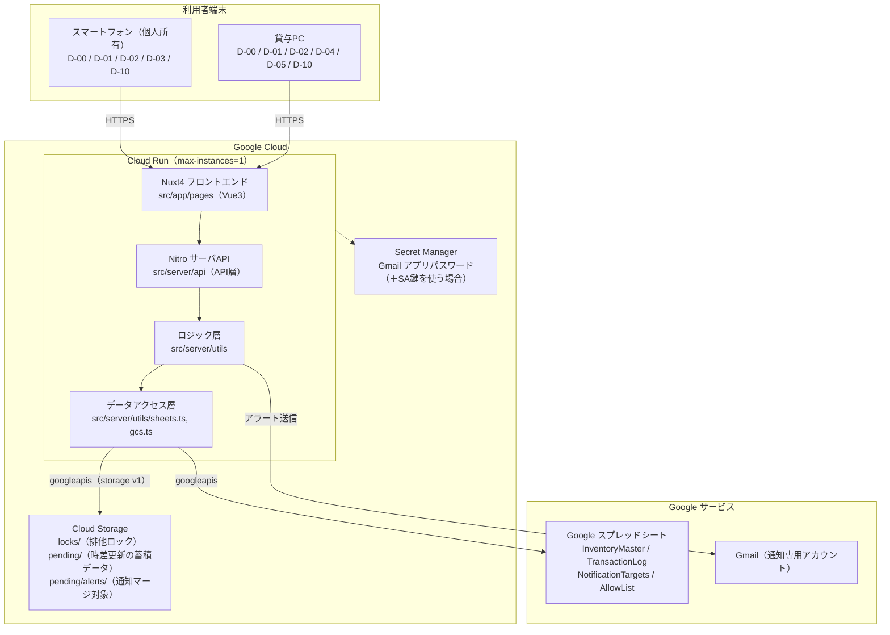
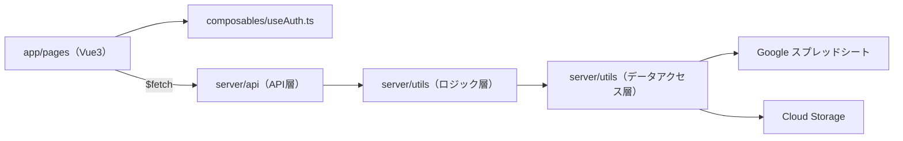

# 全体構成図

## 1. 目的

要件定義（[requestment.md](../requirements/requestment.md)）9章「開発フロー」3.全体設計にあたる。
以下をもって、本書の完了とする。

- システムを構成するドメイン（在庫管理、在庫通知管理、排他制御／時差更新）の責務分界を明確にする
- 要件6章のレイヤード構成（API層・ロジック層・データアクセス層）を、Nuxt4 プロジェクトのファイル単位に対応づける
- 一人開発＋AIコード生成前提（NR-05）のため、プロジェクトのファイル構成を先に決め、属人化を避ける
- git管理するため、Markdown + Mermaid で作成する

> **アーキテクチャ前提（重要）**
> 本システムは **Nuxt4（TypeScript / Vue3）を Google Cloud（Cloud Run 想定）にデプロイし、`googleapis` から Google スプレッドシートを DB として操作する**構成をとる（要件6章）。
> 旧構成（Google Apps Script + `LockService` + `CacheService`）の前提は用いない。技術検証（[technical_verification.md](../requirements/technical_verification.md)、2026-09-08 実施）もこの新構成を前提に実施済み。

---

## 2. 全体構成図



### 2.2 フォルダ構成

```
inventory_system_2/                プロジェクトルート
├── docs/                          ドキュメントフォルダ
│   ├── requirements/              要件定義
│   │   ├── requestment.md            要件定義書
│   │   └── technical_verification.md 技術検証結果
│   ├── architecture/             設計書
│   │   ├── overview.md              全体構成（本書）
│   │   ├── sequence.md              主要シーケンス
│   │   ├── database.md              データベース設計
│   │   └── transition.md            画面遷移設計
│   └── manuals/
│       ├── user_manual.md           ユーザーマニュアル
│       └── deployment.md            デプロイ／インフラ構築手順
└── src/                          Nuxt4 プロジェクトルート
    ├── nuxt.config.ts               runtimeConfig で GOOGLE_* を読み込む
    ├── package.json
    ├── app/                         フロントエンド（Vue3 + TypeScript）
    │   ├── app.vue
    │   ├── pages/                   画面（要件8章 D-xx に対応）
    │   │   ├── index.vue               D-00 ログイン画面
    │   │   ├── dashboard.vue           D-01 ダッシュボード
    │   │   ├── list.vue                D-02 在庫一覧画面（管理者のみ時差更新ボタン。3-12）
    │   │   ├── inport_qr.vue           D-03 コードスキャン画面（スマホのみ）
    │   │   ├── export_qr.vue           D-04 QRコード発行・印刷画面（PCのみ）
    │   │   ├── threshold.vue           D-05 閾値設定画面（PCのみ・管理者）
    │   │   └── user_info.vue           D-10 ユーザ情報画面（FR-13 / 3-10、管理者のみ通知先設定 3-9）
    │   ├── composables/
    │   │   └── useAuth.ts           ログインユーザ／セッションIDの保持（状態管理層）
    │   ├── utils/
    │   │   ├── itemId.ts           読み取りコードの itemId 正規化（QR / JAN / GS1。4.5）
    │   │   └── device.ts           UA による端末判定（スマホ / PC。導線出し分け）
    │   └── middleware/
    │       └── auth.ts             未ログイン時に D-00 へリダイレクト
    ├── server/                      バックエンド（Nitro）
    │   ├── api/                     API層（ルーティングに専念し、処理本体は書かない）
    │   │   ├── auth/
    │   │   │   ├── login.post.ts       POST   /api/auth/login
    │   │   │   ├── logout.post.ts      POST   /api/auth/logout
    │   │   │   └── user.get.ts         GET    /api/auth/user
    │   │   ├── user/
    │   │   │   └── password.put.ts     PUT    /api/user/password（本人・FR-13）
    │   │   ├── users/                  （管理者・3-10）
    │   │   │   ├── index.get.ts        GET    /api/users
    │   │   │   └── [allowId]/password.put.ts  PUT /api/users/{allowId}/password
    │   │   ├── inventory/
    │   │   │   ├── index.get.ts        GET    /api/inventory
    │   │   │   └── [itemId]/
    │   │   │       ├── index.get.ts    GET    /api/inventory/{itemId}
    │   │   │       └── discontinued.put.ts  PUT /api/inventory/{itemId}/discontinued（管理者）
    │   │   ├── scan.post.ts            POST   /api/scan（入出庫・新規登録）
    │   │   ├── threshold.put.ts        PUT    /api/threshold（管理者）
    │   │   ├── notification-targets/   （管理者・FR-09）
    │   │   │   ├── index.get.ts        GET    /api/notification-targets
    │   │   │   ├── index.post.ts       POST   /api/notification-targets
    │   │   │   └── index.delete.ts     DELETE /api/notification-targets
    │   │   └── deferred-sync.post.ts   POST   /api/deferred-sync（管理者）
    │   └── utils/                   ロジック層・データアクセス層
    │       ├── session.ts          セッション発行・検証・破棄（ロジック層）
    │       ├── users.ts            許可リスト参照・パスワード再ハッシュ（ロジック層）
    │       ├── inventory.ts        在庫増減・閾値判定・採番（ロジック層）
    │       ├── alert.ts            アラートメール送信・マージ、通知先設定（ロジック層）
    │       ├── lock.ts             GCS オブジェクトロック取得／解放（ロジック層）
    │       ├── serialize.ts        単一インスタンス内の直列化用 Promise チェーン（6.1。現状どの書き込み処理からも呼ばれていない未使用ユーティリティ）
    │       ├── deferredSync.ts     蓄積データの後追い適用＝時差更新（ロジック層）
    │       ├── sheets.ts           スプレッドシート読み書き（データアクセス層）
    │       └── gcs.ts              Cloud Storage 読み書き（データアクセス層。`googleapis` の storage v1 クライアントを使用。`@google-cloud/storage` は追加していない）
    ├── scripts/
    │   └── hash-password.ts         bcryptハッシュ生成CLI（`npm run hash-password`。ユーザ登録時に手入力でハッシュを作成。要件3-1）
    ├── data/
    │   └── sessions.json            セッション実体（リポジトリ管理外。再デプロイで消失＝全員再ログイン。許容。6.3）
    └── public/
```

主要なロジック層・データアクセス層ファイルの責務（すべて実装済み。上記フォルダ構成の対応先）:

| ファイル | 層 | 責務 |
|---|---|---|
| `server/utils/users.ts` | ロジック層 | 許可リスト一覧の取得、本人／管理者によるパスワード再ハッシュ（FR-13 / 3-10） |
| `server/utils/inventory.ts` | ロジック層 | 在庫増減、閾値判定、アラート送信要否、`ITM-` 採番（FR-06 / FR-07 / FR-12） |
| `server/utils/alert.ts` | ロジック層 | 通知先設定への在庫アラートメール送信・マージ送信（FR-09）、通知先設定（NotificationTargets）の一覧取得・追加・削除（D-10、3-9、[sequence.md](sequence.md) 2.8） |
| `server/utils/lock.ts` | ロジック層 | GCS オブジェクトロックの取得／解放（FR-14） |
| `server/utils/serialize.ts` | ロジック層 | 単一インスタンス内の書き込み処理を Promise チェーンで直列化するユーティリティ（6.1）。**関数は実装済みだがどこからも呼ばれておらず、現状の直列化は GCS ロック（`lock.ts`）と Cloud Run `max-instances=1` のみで担っている** |
| `server/utils/deferredSync.ts` | ロジック層 | 蓄積データの後追い適用＝時差更新（FR-15） |
| `server/utils/gcs.ts` | データアクセス層 | Cloud Storage（`locks/` `pending/` `pending/alerts/`）の読み書き。`googleapis` の storage v1 クライアントを使用 |
| `app/utils/itemId.ts` | FE ユーティリティ | 読み取りコードの itemId 正規化（クライアント側。4.5） |
| `app/utils/device.ts` | FE ユーティリティ | UA による端末判定（4章） |

- **命名規則**
  - 1ファイル＝1責務。他モジュールから参照しない関数は `export` しない（旧GASの `_` サフィックス慣習は用いない）。
  - すべてのスプレッドシート／GCS アクセスはデータアクセス層（`sheets.ts` / `gcs.ts`）に集約し、ロジック層・API層から直接 `googleapis` を呼ばない。
- **コメント**
  - 各関数の先頭に「何を受け取り、何を返し、何をロックするか」を1〜2行で記載する規約とする（NR-05）。
- **設定値**
  - スプレッドシートID・SA認証情報は `.env` の `GOOGLE_SPREADSHEET_ID` / `GOOGLE_SERVICE_ACCOUNT_EMAIL` / `GOOGLE_PRIVATE_KEY` を `nuxt.config.ts` の `runtimeConfig` 経由で読み取る（リポジトリには含めない）。ほかに `GCS_BUCKET`（状態バケット名）、`GMAIL_SENDER` / `GMAIL_APP_PASSWORD`（通知メール送信）を用いる。
  - 本番は Cloud Run に実行SAをアタッチ（ADC）して Sheets / GCS へアクセスし、Gmail アプリパスワード等の秘匿値は Secret Manager に格納する。環境ごとの具体的な変数一覧・IAM・作成手順は [deployment.md](../manuals/deployment.md) を参照。

---

## 3. ドメイン構成と責務の分離

| ドメイン | 主な責務 | 関連要件 |
|---|---|---|
| 在庫管理 | 在庫一覧表示、入庫／出庫による在庫増減、未登録品目の自動登録、QRコード発行、閾値設定、廃番管理 | FR-02〜FR-08、FR-11、FR-12 |
| 在庫通知管理 | 現在在庫数と閾値の比較、アラート送信済みフラグ管理、通知先設定への自動メール送信、Gmail 上限到達時の当日停止・管理者ログイン時のマージ送信 | FR-09、3-9 |
| 排他制御／時差更新 | 入出庫更新時の排他ロック取得、待ち時間超過時の蓄積データ退避、管理者操作による後追い適用（対象は入庫・出庫のみ。新規登録・閾値設定は同期リトライ） | FR-14、FR-15、3-12 |
| 認証・セッション | AllowList 照合（bcryptjs）、セッション発行・有効期限管理・破棄、退職フラグによる拒否 | FR-01、FR-13、3-2、3-3 |

- ドメイン間の依存方向は「在庫管理 → 在庫通知管理」「在庫管理 → 排他制御／時差更新」の一方向とし、通知・排他側から在庫管理を呼ばない。
- 管理者のスプレッドシート直接編集は、いずれのドメインの制御対象にも含めない（要件10章、運用でカバー）。

### 3.1 レイヤー構成（Nuxt4 内部）

要件6章の「API層・ロジック層・データアクセス層」を、以下のファイル単位に対応させる。

| 要件6章のレイヤー | Nuxt4 での対応 | 該当ファイル | 責務 |
|---|---|---|---|
| API層 | Nitro サーバルート | `src/server/api/**/*.ts` | リクエスト受付・入力検証・セッション検証・ロジック層への委譲。業務処理は書かない |
| ロジック層 | サーバユーティリティ | `src/server/utils/*.ts`（`session.ts` / `inventory.ts` / `alert.ts` / `lock.ts` / `deferredSync.ts` / `users.ts`） | 在庫増減、閾値判定、排他制御、時差更新、アラート要否判定 |
| データアクセス層 | サーバユーティリティ | `src/server/utils/sheets.ts` / `gcs.ts` | スプレッドシート・GCS への読み書きをここに集約 |
| 状態管理層（FE） | Nuxt composable | `src/app/composables/useAuth.ts` | ログインユーザ・セッションIDの保持（要件2章「Nuxtjs の状態管理機能によりセッション管理」） |



---

## 4. API設計

### 4.1 共通事項

- すべての業務APIは、`x-session-id` ヘッダのセッションIDを API層で検証する（`validateSession`）。無効時は `code: SESSION_INVALID` を返し、クライアントは D-00 へ強制遷移する（要件3-3）。
- 成功時は `{ status: "OK", data: ... }`、失敗時は `{ status: "ERROR", code: ..., message: ... }` を基本形とする（`code` は 4.2 / 5章のコード表に従う）。リクエスト／レスポンスのボディ構造と項目バリデーションは 4.6 に定める。
- 操作者は「セッションに紐づくメールアドレス」をサーバ側で解決し、クライアントからは受け取らない（なりすまし面の縮小、FR-06 / FR-07）。
- 管理者専用API（`PUT /api/threshold`、`PUT /api/inventory/{itemId}/discontinued`、`GET/POST/DELETE /api/notification-targets`、`POST /api/deferred-sync`、`GET /api/users`、`PUT /api/users/{allowId}/password`）は、API層で `x-session-id` から `AllowList` 行を再解決し `targetId` の有無で管理者判定を行う。クライアント（`useAuth` の管理者フラグ）は信頼しない。非管理者の呼び出しは `code: PERMISSION_DENIED`（HTTP 403）。
- `itemId` はサーバ側でも形式を再検証する（`^ITM-\d{6}$`）。`GET /api/inventory/{itemId}` のパス値のみ、GTIN での検索を許すため `^\d{14}$` も許容する（4.6）。GS1 / JAN の解析・正規化はクライアントで行う（4.5）ため、サーバは受領値を信頼せず検証してから使用する。

### 4.2 エンドポイント一覧

| メソッド / パス | 概要 | 状態 | 関連要件 |
|---|---|---|---|
| `POST /api/auth/login` | メール＋パスワードを AllowList と照合しセッション発行。退職フラグ true は拒否 | 実装済 | FR-01、3-2 |
| `POST /api/auth/logout` | セッション破棄 | 実装済 | 3-3 |
| `GET /api/auth/user` | セッション検証・有効期限の延長 | 実装済 | 3-3 |
| `PUT /api/user/password` | ログイン中ユーザのパスワード更新（bcryptjs 再ハッシュ） | 実装済 | FR-13、3-10 |
| `GET /api/users` | 許可リスト一覧の取得（`allowId` / メールアドレス / 管理者判定 / 退職フラグ / 更新年月日。パスワードハッシュは返さない）。管理者のみ | 実装済 | 3-10、FR-13 |
| `PUT /api/users/{allowId}/password` | 管理者が対象ユーザのパスワードをリセット（新パスワードを bcryptjs でハッシュ化し `AllowList` を更新）。管理者のみ | 実装済 | 3-10、FR-13 |
| `GET /api/inventory` | 在庫一覧取得（品目ID・GTIN・品目名・現在在庫数・閾値・アラート送信済みフラグ・保管場所・廃番フラグ・更新年月日） | 実装済 | FR-02、3-4 |
| `GET /api/inventory/{itemId}` | 品目単体取得。パス値は itemId（`ITM-xxxxxx`）または GTIN（14桁）のどちらでも可（4.5 / 4.6）。未登録時は `code: ITEM_NOT_FOUND` | 実装済 | FR-05、3-5〜3-7 |
| `POST /api/scan` | 入出庫処理（`type: IN\|OUT`、`quantity`）。未登録品目は品目名・閾値・保管場所（＋ D-03 経由なら読み取った `gtin`）を伴って新規登録＋1点入庫（IN固定、OUT不可）。新規登録は登録経路によらずロック区間内で `ITM-` の最大連番+1 を採番し `data.itemId` で返す。`gtin` 指定時は登録前にロック区間内で重複登録がないか再確認する。出庫数量が現在在庫数を超える場合は `INSUFFICIENT_STOCK` | 実装済 | FR-06、FR-07、FR-12 |
| `PUT /api/threshold` | 品目ごとの閾値更新（複数一括）。管理者のみ。`locks/inventory.lock` を取得して更新 | 実装済 | FR-08、3-8 |
| `PUT /api/inventory/{itemId}/discontinued` | 廃番フラグ更新。管理者のみ。`locks/inventory.lock` を取得して更新 | 実装済 | FR-11、3-8 |
| `GET /api/notification-targets` / `POST` / `DELETE` | 通知先メールアドレスの参照・追加・削除。管理者のみ。`POST` は `locks/inventory.lock` を取得し `targetId` を `TAR-` の3桁連番（`TAR-001`〜）で採番。`AllowList.targetId` はこの値を参照して管理者に紐付く | 実装済 | FR-09、3-9 |
| `POST /api/deferred-sync` | 蓄積データ（`pending/` 直下）を名前順に後追い適用。管理者のみ。`pending/alerts/` は対象外 | 実装済 | FR-15、3-12 |

### 4.3 QRコード発行（D-04）

- QRコードは品目IDを直接エンコードする。生成・印刷レイアウト出力はクライアント側で `qrcode` ライブラリを用いて行い、新規APIは追加しない（再発行時は `GET /api/inventory` の結果から選択して再生成）。
- 新規品目登録を伴う場合は `POST /api/scan`（新規登録＋入庫）と同一経路に合流させる。**品目ID（`ITM-xxxxxx`）はクライアントから送らず、サーバがロック区間内で `ITM-` の最大連番+1 を採番し、レスポンス `data.itemId` で返す。** D-04 はメーカーバーコードを持たない品目が対象のため `gtin` は送らない。クライアントは返却された `itemId` を使って QR を生成する（採番前に印刷しない）。

### 4.4 アラートメール送信（FR-09）

- `POST /api/scan` のロジック層内、在庫更新確定後（ロック区間内）に「更新後在庫数 < 閾値」かつ「`alertSentFlag = false`」を判定し、送信要否を決める。
- メールの形式（HTML メール。`From` 表示名は暫定で `在庫管理システム <GMAIL_SENDER>`）:
  - 件名: `在庫数アラート`（通常送信・マージ送信とも同一）
  - 通常送信（単一品目）本文: `[品目名]の在庫が閾値以下です。<br>確認してください。`
  - マージ送信（複数品目、6.4）本文: 対象品目名を `[品目名]の在庫が閾値以下です。<br>` でループ連結し、末尾に `確認お願いします。` を1行追加する。
- 実際のメール送信と `alertSentFlag` の更新はロック解放後の独立系とし、失敗しても在庫更新自体は成功として返す（5章）。送信成功時に `alertSentFlag` を true にする。並行入出庫でまれに重複通知が起こり得るが、検証グレードの許容リスクとする。
- 送信に失敗した場合（Gmail 上限 HTTP 429 / `RESOURCE_EXHAUSTED` を含む）は、`pending/alerts/{itemId}.json` にマージ対象情報 `{ itemId, itemName, threshold, detectedStock, detectedAt }` を書き出す（同一 `itemId` は上書き＝品目単位で1件。`alertSentFlag` は false のまま）。当日の再送は行わない。管理者のログイン成功時にまとめて送信し、送信成功で当該 `itemId` の `alertSentFlag` を true にして該当オブジェクトを削除する（6.4）。
- 入庫で閾値以上へ回復した場合は、ロック区間内の在庫マスタ更新に含めて `alertSentFlag` を true → false に戻し、`pending/alerts/{itemId}.json` があれば削除する（3-9、再通知の抑止）。

### 4.5 識別コード形式の判定と正規化（FR-05 / FR-12）

D-03 のクライアント（`getUserMedia` + ZXing-js）で読み取った文字列を、以下の規則で正規化する。判定・抽出はクライアント側で行う。

| 読み取り種別 | 入力例 | 正規化規則 | 正規化後の値 | 用途 |
|---|---|---|---|---|
| 自社発行QR | `ITM-000123` | 平文をそのまま使用 | `ITM-000123` | **itemId** としてそのまま利用（D-04 が発行したQRは常にこの形式） |
| JANコード / EAN-13 | `4901234567894` | 13桁の先頭に `0` を付与し GTIN-14 化 | `04901234567894` | **GTIN**（品目の検索キー。itemId ではない） |
| GS1 DataMatrix | `(01)04912345678904(17)...` | GS1 Application Identifier 構造から AI「01」（GTIN）を抽出 | `04912345678904` | **GTIN**（同上） |

- **itemId（`ITM-`）と GTIN は別物**。自社発行QRを読んだ場合はその場で itemId が確定するが、JAN / GS1 DataMatrix を読んだ場合は GTIN しか分からない。クライアントは `GET /api/inventory/{value}`（`value` は itemId または GTIN のどちらでも可。4.6）を呼び、サーバが `InventoryMaster` の `itemId` 列 → `gtin` 列の順で検索して品目を特定する。応答の `data.itemId` が実在する itemId なので、以降の `POST /api/scan`（登録済み品目の入出庫）は必ずこの値を使う。
- 「平文をそのまま使用」は `ITM-` 形式に限る。**QR コード内に数字のみ（13 桁）がエンコードされていた場合は自社発行QRではなく JAN として扱い、先頭 `0` 付与で GTIN-14 化する**（GTIN は GTIN-14 で保持するため）。
- **GS1 パーサの対応範囲**（クライアント実装 `src/app/utils/itemId.ts`）:
  - **AI `01`（GTIN）を抽出する**のが目的。
  - 同一文字列に含まれる他のAIは、GTIN を正しく取り出すために**構造として読み飛ばす**：固定長AI（`01`=14桁 / `11` `12` `13` `15` `17`=6桁 等）は桁数ぶん、可変長AI（`10` `21` 等）は FNC1(`\x1d`)または文字列末尾まで。値の中身は使わない。
  - **未知のAI（読み飛ばす桁数が判断できない）・`01` が見つからない・GTIN のチェックディジット不一致は例外**とし、誤った値を登録しない（要件10章）。
  - 実装は技術検証「検証4」の参考実装（`verification/04b_gs1_parser.mjs`）を土台に `src/` へ**書き起こす**。検証コード自体はリポジトリに取り込まない。
- 品目が未登録（`ITEM_NOT_FOUND`）の場合、D-03 は読み取った GTIN を保持したまま新規登録フォームへ遷移し、`POST /api/scan` に `gtin` として渡す（`itemId` は渡さない。サーバが `ITM-` を採番。2.5）。自社発行QRの読み取り（登録済みのはずが未登録＝ラベル誤り等）では `gtin` は送らない。
- サーバも受領した値の形式を再検証する：`itemId` は `^ITM-\d{6}$`、`GET /api/inventory/{value}` のパス値のみ GTIN（`^\d{14}$`）も許容（4.1）。
- 実機（iOS Safari / Android Chrome）での読み取り精度検証は `verification/`（git 管理外。technical_verification.md 0章）で継続する。

### 4.6 リクエスト／レスポンスのスキーマと入力検証

- 共通: 業務APIは `x-session-id`（UUID 文字列）ヘッダ必須。日時はすべて UTC の ISO8601 文字列（[database.md](database.md) 冒頭）。バリデーション違反は `INVALID_INPUT`（HTTP 400、該当項目のメッセージ）。
- API層で検証し、通過した値のみロジック層へ渡す。文字列は前後空白をトリムし、制御文字を除去する。

| エンドポイント | リクエストボディ（主な項目・制約） | 成功レスポンス `data` |
|---|---|---|
| `POST /api/auth/login` | `email`（必須 / RFC5322 簡易 / ≤254）、`password`（必須 / 1–72 文字） | `{ sessionId, user: { email, isAdmin } }` |
| `POST /api/auth/logout` | なし | `null` |
| `GET /api/auth/user` | なし | `{ user: { email, isAdmin } }` |
| `PUT /api/user/password` | `newPassword`（必須 / 8–72 文字）、`newPasswordConfirm`（必須 / 一致） | `null` |
| `GET /api/users` | なし（管理者のみ） | `{ allowId, email, isAdmin, retiredFlag, updatedAt }[]`（パスワードハッシュは含めない。退職者・管理者自身も含む全件） |
| `PUT /api/users/{allowId}/password` | パス `allowId`（必須）、`newPassword`（必須 / 8–72 文字）、`newPasswordConfirm`（必須 / 一致）。管理者のみ。対象が存在しなければ `INVALID_INPUT` | `null` |
| `GET /api/inventory` | なし（クエリでの絞り込みは任意） | `Item[]`（`itemId, gtin, itemName, currentStock, threshold, location, discontinuedFlag`） |
| `GET /api/inventory/{itemId}` | パス値（`^ITM-\d{6}$` の itemId、または `^\d{14}$` の GTIN）。GTIN の場合は `gtin` 列で検索する | `Item`（`itemId` は実在するID。未登録は `ITEM_NOT_FOUND`） |
| `POST /api/scan` | `itemId`（既存品目時は必須 / `^ITM-\d{6}$`。新規登録時は送らない）、`type`（`"IN"` / `"OUT"`）、`quantity`（整数 ≥ 1）、新規登録時のみ `itemName`（必須 / 1–100）・`threshold`（整数 ≥ 0）・`location`（0–100）・`gtin`（任意 / `^\d{14}$`。D-03 のバーコード読み取り経由のみ）。新規登録時 `type` は `IN` 固定、`quantity` は 1 | `{ itemId, currentStock }`（`itemId` は新規登録時にサーバが採番した値） |
| `PUT /api/threshold` | `items`（1件以上の配列、各 `{ itemId（形式検証）, threshold（整数 ≥ 0） }`） | `{ updated: number }` |
| `PUT /api/inventory/{itemId}/discontinued` | `discontinued`（真偽値、必須） | `null` |
| `GET /api/notification-targets` | なし | `{ targetId, email }[]` |
| `POST /api/notification-targets` | `email`（必須 / メール形式 / ≤254 / 重複不可） | `{ targetId, email }` |
| `DELETE /api/notification-targets` | `targetId`（必須。`AllowList` から参照中の場合は `INVALID_INPUT` で拒否） | `null` |
| `POST /api/deferred-sync` | なし | `{ applied: number, remaining: number }` |

- `POST /api/scan` の出庫で `quantity > currentStock` の場合は `INSUFFICIENT_STOCK`（HTTP 400、5章）。
- 管理者専用API（`threshold` / `discontinued` / `notification-targets` / `deferred-sync` / `users` / `users/{allowId}/password`）は非管理者に `PERMISSION_DENIED`（HTTP 403、4.1）。
- `GET /api/users` はパスワードハッシュを返さない（平文パスワードはそもそも保持しない。[database.md](database.md) 4章）。管理者のユーザ管理は「メールアドレス一覧の閲覧」と「パスワードのリセット（再設定）」に限り、ユーザ行の追加・削除は引き続きスプレッドシートの直接編集で行う（要件10章）。

---

## 5. エラーハンドリング方針

| 分類 | 発生源 | `code`（例） | 挙動 |
|---|---|---|---|
| 入力エラー | API層の入力検証 | `INVALID_INPUT` | HTTP 400。クライアントで該当項目にメッセージ表示、画面遷移しない |
| 認証失敗 | ログイン照合 | `AUTH_FAILED` | HTTP 401。メール未登録・パスワード不一致・退職フラグ true をまとめて同一メッセージで返す（列挙攻撃対策、FR-01） |
| セッション無効 | API層のセッション検証 | `SESSION_INVALID` | HTTP 401。D-00 へ強制遷移。状態管理層（`useAuth`）の保持値をクリア（3-3） |
| 権限エラー | API層の管理者判定 | `PERMISSION_DENIED` | HTTP 403。非管理者が管理者専用API（閾値・廃番・通知先・時差更新）を呼んだ場合。画面遷移しない（D-02 の管理者専用ボタン・D-05 の導線・D-10 の管理者機能は元々非管理者に非表示） |
| 在庫不足 | ロジック層（出庫の在庫チェック） | `INSUFFICIENT_STOCK` | HTTP 400。出庫数量が現在在庫数を超える場合は拒否し、在庫マスタ・履歴とも更新しない（FR-06。マイナス在庫を作らず、記録数量と実減算数量を一致させる）。ロックは取得済みなら解放する |
| 排他ロックタイムアウト | ロジック層（`lock.ts`） | `LOCK_TIMEOUT` | HTTP 409。入出庫：待ち時間 5〜10 秒で取得できなければ、当該操作を蓄積データ（`pending/`）へ退避し「時差更新として受け付けた」旨を返す（FR-14）。**新規品目登録・閾値設定・廃番フラグ更新：退避せずエラーを返し、再実行を促す（時差更新の対象外）** |
| スプレッドシート更新失敗 | データアクセス層 | `SHEET_WRITE_FAILED` | HTTP 502。ロック内で書き込みに失敗した入出庫は、`operationId` 付きで蓄積データへ退避し時差更新対象とする（FR-15）。履歴追記を先に確定してから在庫マスタを更新する順序とし、部分失敗時の二重計上を `operationId` の冪等判定で防ぐ（[sequence.md](sequence.md) 2.1 / 2.6） |
| 品目未登録 | 品目取得 | `ITEM_NOT_FOUND` | HTTP 404。D-03 は新規登録フォームへ分岐（画面分岐用の参考情報。登録可否は `POST /api/scan` 内で再判定） |
| アラートメール送信失敗 | ロジック層（`alert.ts`） | （握りつぶし） | 在庫更新は確定済みのため成功として返す。送信失敗（Gmail 上限 HTTP 429 を含む）は `pending/alerts/{itemId}.json` に退避し、当日は再送しない。管理者ログイン時にまとめて送信する（FR-09、4.4 / 6.4）。エラー詳細はサーバログのみ |
| 通信失敗（クライアント） | `$fetch` | - | クライアントでリトライ導線を表示（要件10章「通信失敗」） |
| 想定外例外 | 全層 | `INTERNAL_ERROR` | HTTP 500。スタックはサーバログのみ、ユーザには汎用メッセージ。DB更新を伴う処理はロック解放を `finally` で保証する |

- ロック取得後は、在庫不足チェック → 履歴追記（`operationId` 付き）→ 在庫マスタ更新（1回の `batchUpdate`）→ アラート送信要否の判定 までを一連で行い、`finally` で必ずロックを解放する（詳細は [sequence.md](sequence.md) 2章）。アラートメールの送信と `alertSentFlag` の更新はロック解放後の独立系とする。

---

## 6. 非機能要件の実現方式

### 6.1 排他制御（FR-14 / 技術検証「検証2」）

- Google スプレッドシート単体では条件付き書き込みAPIが無く、並行更新で lost update が発生することを実証済み。DB の外に排他機構を持つ。
- **主機構: GCS オブジェクトロック**
  - オブジェクト: `locks/inventory.lock`、本文 `{ owner, acquiredAt }`。`owner` は「Cloud Run リビジョン名＋インスタンスID＋リクエストUUID」（障害調査用の識別子）。`acquiredAt` は UTC ISO8601。
  - 取得: `objects.insert(ifGenerationMatch=0)`。成功でロック取得（応答の `generation` を保持）。HTTP 412 なら他者が保持中。
  - リトライ: 412 のたびに待機して再試行。**初回 200ms、指数バックオフ（×2）、上限 1s、±20% ジッタ**。
  - タイムアウト: **合計 8 秒**（要件の「5〜10秒」の中央）取得できなければ、入出庫は蓄積データへ退避して即応答（時差更新へ、5章 `LOCK_TIMEOUT`）。新規登録・閾値・廃番は退避せず `LOCK_TIMEOUT` エラー。
  - スタックロック対策: 取得試行時に本文の `acquiredAt` を見て **30 秒**超過なら `ifGenerationMatch=<その時点の generation>` 付きで強制奪取。複数待機者が同時に奪取を試みても 412 で1人だけ成功し、他は通常のリトライループに戻る。
  - 解放: 保持した `generation` を条件に `objects.delete(ifGenerationMatch=generation)`。412（＝既に奪取された）なら自分のロックではないので何もしない（エラーにしない）。解放は `finally` で必ず試みる。
- **`locks/inventory.lock` は「スプレッドシートへの書き込み全般の直列化ロック」として扱う。** 入出庫（`POST /api/scan`）に加え、閾値設定（`PUT /api/threshold`）・廃番フラグ（`PUT /api/inventory/{itemId}/discontinued`）・新規品目登録・通知先追加（`POST /api/notification-targets`、`TAR-` 採番）も取得してから書き込む。入出庫以外は取得できなければ時差更新に落とさず `LOCK_TIMEOUT` エラーを返し再実行を促す（管理者のみ・低競合のため同期リトライで十分）。ユーザのパスワード更新（`AllowList`）は照合キーに影響しない単一セル更新のためロック対象外。
- **多重防御: Cloud Run `max-instances=1`**（NR-01）。単一インスタンスに強制することで、複数インスタンスが同時に GCS ロックの外側で競合する事態そのものを避ける。
  - `server/utils/serialize.ts` は単一インスタンス内の書き込みを Promise チェーンで直列化するユーティリティ（`current = current.then(task)`、ライブラリ不使用）として実装済みだが、**在庫マスタ / TransactionLog / AllowList / GCS の各書き込み処理（`lock.ts` の `withLock` 経由）からは呼ばれておらず、現状は使用されていない**。単一インスタンス内での排他は GCS ロック（`locks/inventory.lock`）のみで担っている。
  - SA 単位の Sheets クォータ（60 req/分）には別途 6.7 の対策が必要。
- 管理者のスプレッドシート直接編集は排他対象外（要件10章）。
- 将来、ロック層のみ Firestore（ネイティブトランザクション）へ寄せる余地を残す（NR-06）。

### 6.2 時差更新（蓄積データ）（FR-15 / 技術検証「検証1」）

- 対象は更新できなかった**入庫・出庫**のみ。新規品目登録・閾値設定・廃番フラグ更新は対象外（同期リトライ）。
- Cloud Storage バケット（`asia-northeast1`）に、1操作1オブジェクトで保持する。
  - オブジェクト名: `pending/{ISO8601タイムスタンプ}-{ランダム}.json`（時系列は名前順で担保。タイムスタンプは UTC・ミリ秒精度）
  - 中身: `{ operationId, itemId, type: "IN"|"OUT", quantity, operator, occurredAt }`
    - `operationId`（UUID）は冪等な後追い適用に用いる。`TransactionLog` に同 `operationId` の行が既にあれば履歴追記済みとみなし、在庫マスタの整合のみ取る（部分失敗の再適用による二重計上を防ぐ）。
- D-02 の時差更新ボタン（管理者のみ、蓄積データがある場合に活性化）で `POST /api/deferred-sync` を呼び、`pending/` 直下（デリミタ `/`。`pending/alerts/` は除外）を名前順に適用 → 成功分を削除。全件成功でユーザに完了通知、失敗が残れば蓄積データを保持して再実施を促す（3-12）。
- Sheets クォータ（60 req/分/SA、全利用者で共有。6.7）に収めるため、`deferred-sync` のループは **1件処理ごとに約 1.5 秒空ける**（≒40 req/分。ライブ操作ぶんの余裕を残す）。`RESOURCE_EXHAUSTED` を捕捉したら 2s→4s→8s の指数バックオフで最大3回再試行し、なお失敗するなら**その回の処理を打ち切って残件を保持**し再実行を促す（3-12）。
- 最悪ケースは棚卸で在庫数を実数に合わせる運用（NR-02）。

### 6.3 セッション管理（3-2 / 3-3）

- ログイン成功時にセッションID（UUID）と有効期限（30分）を発行する。
- 有効期限はユーザ操作（`GET /api/auth/user` 等）のたびに延長し、期限切れセッションは検証時に破棄して D-00 へ強制遷移する。
- ログアウトでセッションを即時破棄する。
- クライアントは Nuxt の状態管理（`useState`）でセッションIDとユーザ情報を保持する（要件2章）。
- サーバ側のセッション実体は `src/data/sessions.json`（＝単一インスタンスのメモリ相当）。**Cloud Run のファイルシステムはエフェメラルで、再デプロイ・インスタンス再作成でセッションは消失するが、その場合は全利用者が次操作で `SESSION_INVALID` → D-00 で再ログインする運用を許容する**（業務停止ではない。恒久的な外部ストア化はしない）。
- なりすまし対策は検証レベルの運用として行わない（NR-03、要件10章）。

### 6.4 メール通知の認証方式（FR-09 / NR-04 / 技術検証「検証3」）

- サービスアカウント単体では Gmail を送信できない。**既存の Gmail アカウント + アプリパスワード**（Secret Manager 格納、`nodemailer` で `smtp.gmail.com:465` へ送信）を採用する。OAuth2 リフレッシュトークン方式は、テスト公開ステータスでの7日失効・本番切替に要する Google の審査を避けるため不採用とした。
- 送信数上限（無料 Gmail 500 通/日、Workspace 2,000 通/日、引き上げ不可）は業務規模では十分収まる。
- 上限到達（HTTP 429 / `RESOURCE_EXHAUSTED`）や送信失敗を捕捉したら、`pending/alerts/{itemId}.json` にマージ対象情報 `{ itemId, itemName, threshold, detectedStock, detectedAt }` を退避する（品目単位で1件、既存は上書き）。当日の再送は行わない。
- 管理者級整備士のログイン成功時に `pending/alerts/` を確認し、存在すれば保留分を1通にまとめて通知先設定の全アドレスへ送信する。送信成功で、対象各 `itemId` の `alertSentFlag` を true にし、該当オブジェクトを削除する。送信できなければオブジェクトを残し、次の管理者ログインで再試行する。
- スケジューラ（Cloud Scheduler 等）は用いない。「翌日以降のマージ送信」は管理者ログインを契機とする（業務上、管理者は毎営業日ログインする前提）。

### 6.5 コード読み取り／QR生成（FR-05 / FR-12 / 技術検証「検証4」）

- D-03 は `getUserMedia` + ZXing-js（`@zxing/browser` / `@zxing/library`）で QR / JAN / GS1 DataMatrix をワンコードパスで読み取る（正規化は 4.5）。
- **HTTPS 必須・通常ブラウザ限定**。Cloud Run が HTTPS を自動提供するため追加対応は不要だが、サードパーティのアプリ内ブラウザ（LINE / Instagram 等の WebView）ではカメラが動かないため、「コードスキャン画面は Safari / Chrome 等の通常ブラウザで開く」を運用ルールとして取扱説明書に明記する。手入力フォールバックの追加は検討課題。
- QRコード生成・印刷は `qrcode` ライブラリでクライアント生成する。印刷レイアウトはクワイエットゾーン（余白）を確保し、実機印刷検証を待って確定する（D-04）。

### 6.6 その他の非機能要件の対応

| 要件 | 実現方式 |
|---|---|
| NR-01 利用者数（最大10名） | Cloud Run `max-instances=1` + インスタンス内直列化で十分 |
| NR-02 可用性 | 時差更新（6.2）＋ 棚卸運用。致命的停止を避ける代替手段を確保 |
| NR-03 セキュリティ | AllowList 照合 + bcryptjs + セッション（6.3）。利用者は整備士に限定 |
| NR-04 コスト | Cloud Run / Cloud Storage / スプレッドシート / Gmail いずれも無料枠内。Gmail 日次上限に留意（6.4） |
| NR-05 保守性 | レイヤ分離（3.1）+ 関数コメント規約 + 1ファイル1責務。処理の単純化を優先 |
| NR-06 拡張性 | 品目増加はシート行追加で対応。ロック層を将来 Firestore へ寄せる余地を残す |

### 6.7 Google Sheets API クォータと対策（技術検証「検証2」）

- Sheets API は読み取り・書き込みとも **60 リクエスト/分/ユーザ**。本システムは全アクセスを 1 つのサービスアカウント経由で行うため、**全利用者の操作がこの 1 ユーザ枠に合算される**。技術検証中に実際に `RESOURCE_EXHAUSTED`（`Read requests per minute per user`）へ到達している。
- 対策:
  - **バッチ集約**: 在庫マスタの読み取りは `spreadsheets.values.batchGet`、更新は `spreadsheets.values.batchUpdate` を用い、1操作あたりのリクエスト数を最小化する（在庫マスタの `currentStock` / `updatedAt` / `alertSentFlag` の複数セル更新、閾値の複数行一括更新を1リクエストにまとめる）。
  - **`deferred-sync` のレート制御**: 1件ずつロック→更新するループに、1件あたりの待機と、`RESOURCE_EXHAUSTED` 捕捉時の指数バックオフを入れる。1分あたりのリクエストが上限に収まらない場合は、処理を打ち切って残件を保持し再実行を促す（既存仕様と同じ）。
  - **在庫マスタの短TTLキャッシュ**: データアクセス層に数秒程度のインメモリキャッシュを置き、`GET /api/inventory` / `GET /api/inventory/{itemId}` の連続読み取りを抑える。ロック区間内で在庫マスタを更新したらキャッシュを無効化する（`max-instances=1` のため単一インスタンスで完結）。
  - **在庫マスタの行検索**: `itemId`（該当なければ `gtin`）での検索は「シート全体を 1 回 `values.get` / `batchGet` で読み、JS 側で線形探索」でよい。品目数は数百規模、payload は数十KB、線形探索のコストは誤差。行番号インデックスや索引シートは持たない。更新は探した行番号へ `batchUpdate`。ロック区間内で「行検索 → 更新」を一連で行うため、検索と更新の間で行がずれることはない（管理者の直接編集は要件10章で運用回避）。

### 6.8 既知の制限事項

| # | 制限 | 影響 | 運用での緩和 |
|---|---|---|---|
| 1 | 同一の物理部品が D-04（自社発行QR、`gtin` なし）で先に登録された後、そのメーカーバーコードを D-03 でスキャンすると `gtin` 列が空のため未登録と判定され、別の `itemId` として重複登録され得る（4.5 / FR-12） | 同一部品が2つの `itemId` に分裂し、在庫数・入出庫履歴が分散する。設計上の検出・防止機構はない | 既存のQRラベルがあればそれを貼り直して使う（新たにメーカーバーコードで読み直さない）。新規スキャン前に D-02 在庫一覧で同名品目が無いか確認する。重複が判明した場合は棚卸で一本化する（NR-02 と同様の運用） |
| 2 | 時差更新（`deferredSync.ts`）の適用時に対象 `itemId` が在庫マスタに見つからない場合、当該 `pending/` オブジェクトはエラーにせず削除される（`TransactionLog` への追記も行わない） | 対象品目が廃止・誤入力等で存在しない場合、その入出庫はどこにも記録されずに消える | 通常運用では発生しない（品目削除機能が無いため）。発生した場合は棚卸で実数に合わせる（NR-02 と同様の運用） |

---

## 7. 以降の検討事項

> インフラ構築・IAM・バケット・Secret Manager・デプロイコマンド・デプロイ後の疎通確認の**具体的な手順は [deployment.md](../manuals/deployment.md)** に集約した。本章はそれ以外の未決事項を残す。

| # | 項目 | 契機 | 参照 |
|---|---|---|---|
| 1 | 一時データ／ロック用 GCS バケットの作成と実行SAへの権限付与 → GCS 実書き込み・オブジェクトロックの再検証 | インフラ準備 | [deployment.md](../manuals/deployment.md) 3.3 / 6、technical_verification.md 検証1・検証2 |
| 2 | メール通知の認証方式の確定（Gmail SMTP + アプリパスワード）→ 実送信の疎通確認 | インフラ準備 | [deployment.md](../manuals/deployment.md) 3.5 / 6、technical_verification.md 検証3 |
| 3 | 実機（iOS Safari / Android Chrome）でのカメラ読み取り・GTIN 抽出の検証 | 実装フェーズ | [deployment.md](../manuals/deployment.md) 6、technical_verification.md 検証4 |
| 4 | QR印刷レイアウト（ラベル用紙サイズ、クワイエットゾーン）の実機印刷検証。印刷用CSS（`@page`、91mm×55mm）は実装済みで、用紙上の実寸確認が残る | 実装フェーズ | 6.5 |
| 5 | ユーザーマニュアル（`docs/manuals/user_manual.md`）の新構成への全面改訂（2ドメイン記述・パスワードなし認証の記述などを是正） | 実装完了後 | - |
| 6 | GS1 DataMatrix 手入力フォールバック（ラベル破損時の代替）の要否確定。アプリ内ブラウザ（LINE/Slack等）については、カメラ起動失敗時に「通常ブラウザで開き直してください」と案内するメッセージのみ実装済み（`inport_qr.vue`） | 実装フェーズ | 6.5 |
