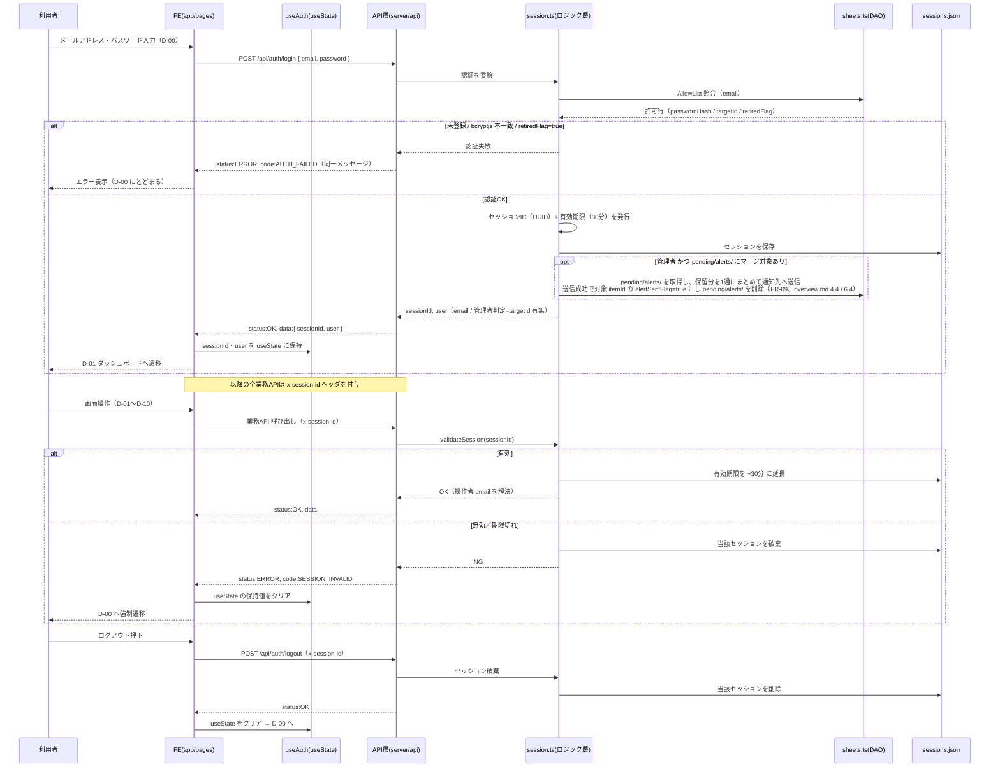
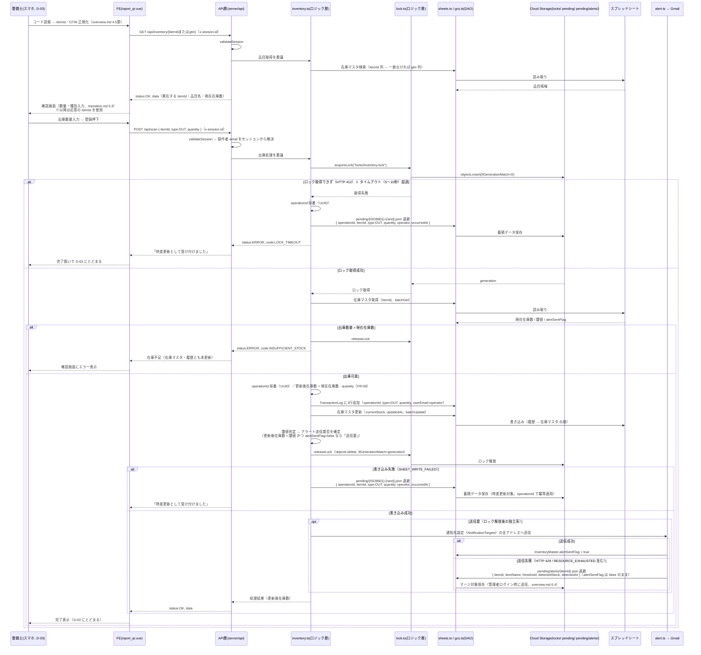
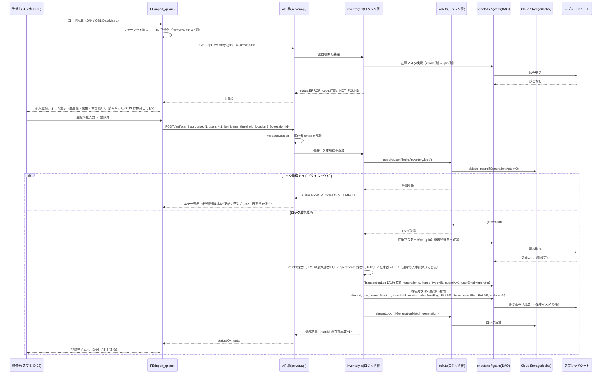
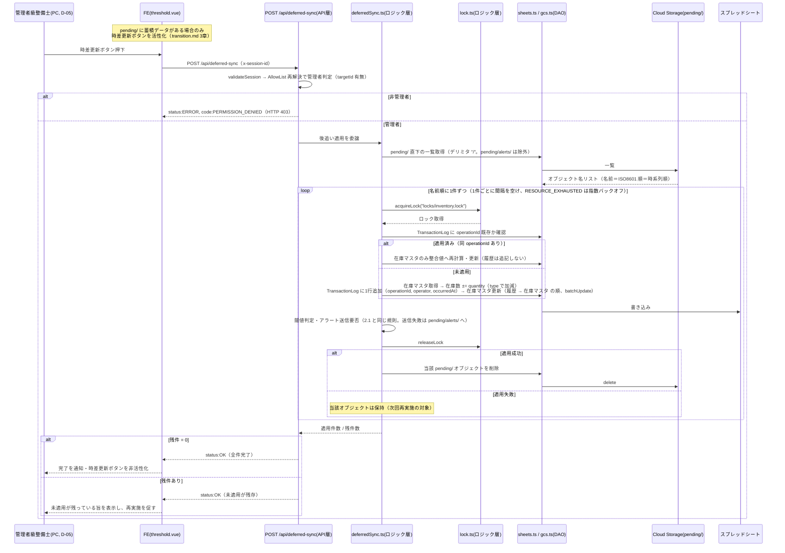
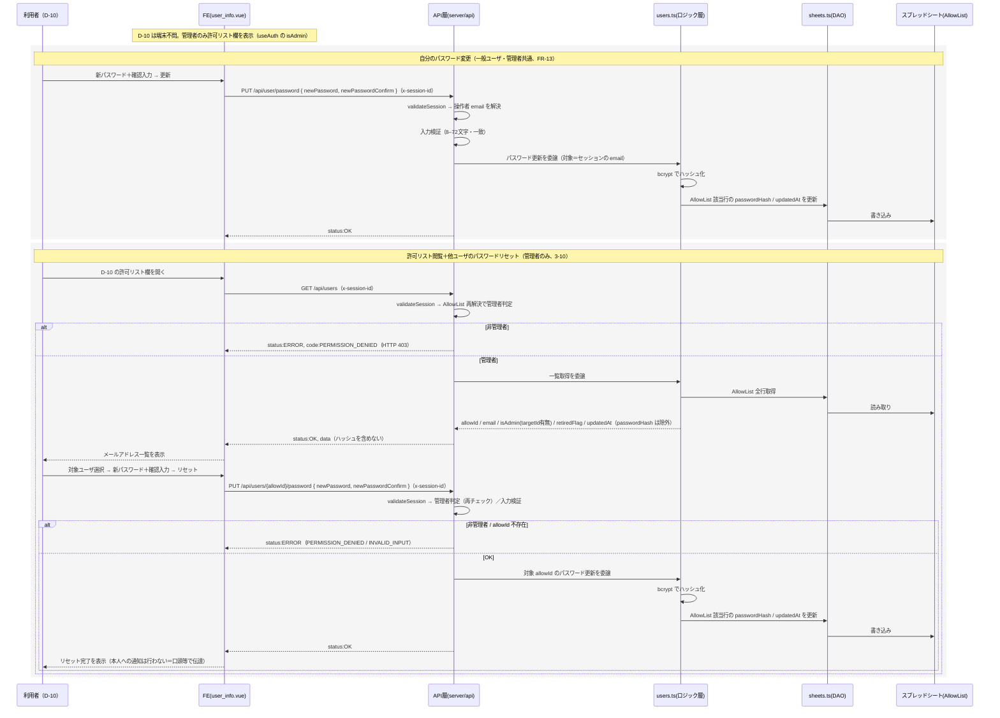

# セッション設計 / シーケンス設計

- 対象システム：整備部品在庫管理システムv2
- 本書の位置付け：セッション設計・主要処理フローの詳細設計（要件定義 9章「開発フロー」4.シーケンス作成にあたる）
- 対応要件：[requestment.md](../requirements/requestment.md)、全体構成：[overview.md](overview.md)、データ設計：[database.md](database.md)、画面設計：[transition.md](transition.md)

> **アーキテクチャ前提（[overview.md](overview.md) と共通）**
> 本システムは **単一の Nuxt4 アプリ（TypeScript / Vue3）を Google Cloud（Cloud Run、`max-instances=1`）にデプロイし、`googleapis` から Google スプレッドシートを DB として操作する**構成をとる（要件6章）。
> 旧構成（GAS Web App ＋ 外部ホスティングの2ドメイン、`CacheService` / `LockService` / `GmailApp`、URLパラメータでのトークン受け渡し）は**用いない**。本書は 2026-09-10 に旧GAS版から新構成へ改訂した。

登場要素（[overview.md](overview.md) 2章・3.1節に対応）:

| 記号 | 対応 | 層 |
|---|---|---|
| FE | `src/app/pages/*.vue`（Vue3） | フロントエンド |
| Auth | `src/app/composables/useAuth.ts`（`useState`） | 状態管理層（FE） |
| API | `src/server/api/**/*.ts`（Nitro ルート） | API層 |
| Logic | `src/server/utils/{session,inventory,alert,lock,deferredSync}.ts` | ロジック層 |
| DAO | `src/server/utils/{sheets,gcs}.ts` | データアクセス層 |
| SS | Google スプレッドシート（`InventoryMaster` / `TransactionLog` / `NotificationTargets` / `AllowList`） | 外部 |
| GCS | Cloud Storage（`locks/` 排他ロック、`pending/` 時差更新の蓄積データ、`pending/alerts/` 通知マージ対象） | 外部 |
| Gmail | 通知用 Gmail アカウント（アプリパスワード、SMTP送信） | 外部 |

---

## 1. セッション設計

### 1.1 セッションのライフサイクル

### 1.2 設計上の要点（要件 3-2 / 3-3、[overview.md](overview.md) 6.3 の具体化）

- 有効期限：30分。ログイン発行時に設定し、`GET /api/auth/user` を含む業務API のたびに検証時点から +30分 へ延長する（要件 3-3）。
- 期限切れセッションは検証時に破棄し、クライアントは操作画面を問わず D-00 へ強制遷移して状態管理層（`useAuth` / `useState`）の保持値をクリアする（要件 3-3、[transition.md](transition.md) 2章）。
- セッションIDは推測困難なランダム文字列（UUID）とし、メールアドレス等の個人情報を含めない。
- 操作者（メールアドレス）はサーバがセッションから解決し、クライアントからは受け取らない（なりすまし面の縮小、FR-06 / FR-07）。
- なりすまし対策は検証レベルの許容リスクとして行わない（NR-03、要件10章）。
- 認証失敗（未登録・パスワード不一致・退職フラグ true）は同一メッセージ（`AUTH_FAILED`）で返す（列挙攻撃対策、FR-01）。
- 管理者のログイン成功時に、Gmail 上限等で保留されたアラート通知（`pending/alerts/`）があればまとめて送信し、送信成功で対象 `itemId` の `alertSentFlag` を true にして削除する（FR-09、[overview.md](overview.md) 4.4 / 6.4）。「翌日以降のマージ送信」はこの管理者ログインを契機とし、スケジューラは用いない。

### 1.3 セッション永続化（方針確定 2026-09-11）

- セッション実体は `src/data/sessions.json`（サーバ上のファイル＝単一インスタンスのメモリ相当）。Cloud Run のファイルシステムはエフェメラルで、再デプロイ・インスタンス再作成で消失する。
- **消失時は全利用者が次操作で `SESSION_INVALID` → D-00 で再ログインする運用を許容する**（業務停止ではない）。外部ストア（GCS / Firestore / 署名済み Cookie）への移行はしない。詳細は [overview.md](overview.md) 6.3。

---

## 2. シーケンス設計

### 2.1 出庫処理シーケンス（D-03 起点、FR-06・FR-09 該当）

- ロック取得 → 在庫不足チェック → 履歴追記（`operationId` 付き）→ 在庫マスタ更新（1回の `batchUpdate`）→ アラート送信要否の確定 までを一連で行い、`finally` で必ずロックを解放する（[overview.md](overview.md) 5章）。**履歴を先に確定し、在庫マスタはそれと整合する値へ更新する**（部分失敗時、`operationId` の冪等判定で二重計上を防ぐ。2.6 参照）。
- 出庫数量が現在在庫数を超える場合は `INSUFFICIENT_STOCK` で拒否し、在庫マスタ・履歴とも更新しない（マイナス在庫を作らず、記録数量＝実減算数量とする、FR-06）。
- 旧構成の `SpreadsheetApp.flush()` は不要。`googleapis` は各書き込みの HTTP 応答を同期的に待つため、応答受領をもって反映確定とみなす。
- アラートメールの送信と `alertSentFlag` の更新はロック解放後の独立系とし、失敗しても在庫更新自体は成功として返す。送信成功で `alertSentFlag=true`、送信失敗（HTTP 429 含む）は `pending/alerts/{itemId}.json` へ退避し管理者ログイン時にマージ送信する（[overview.md](overview.md) 4.4 / 6.4）。並行入出庫でまれに重複通知が起こり得るが検証グレードの許容リスクとする（なりすまし等と同様、NR-03 / 要件10章）。

### 2.2 入庫処理シーケンス（FR-07 該当）の差分

出庫（2.1）と同一のトランザクション構造だが、以下が異なる。

- 現在在庫数は `+= quantity`。在庫不足チェック（`INSUFFICIENT_STOCK`）は不要。
- 閾値判定は「入庫後に閾値以上（更新後在庫数 ≧ 閾値）へ回復したか」を見る。
- 回復し、かつ `alertSentFlag=true` の場合、**ロック区間内の在庫マスタ更新（`batchUpdate`）に含めて** `alertSentFlag` を `true → false` に戻す（再度閾値を下回った際に再通知できるようにする、要件 3-9）。あわせて `pending/alerts/{itemId}.json`（未送信のマージ対象）があれば削除する。
- 入庫では在庫が減らないためアラートメール送信は発生しない。
- `operationId` の採番、履歴→在庫マスタの順序、書き込み失敗時の `pending/` 退避は出庫（2.1）と同じ。

### 2.3 排他制御の要点（技術検証「検証2」の反映、FR-14）

- スプレッドシート単体では条件付き書き込みAPIが無く並行更新で lost update が起きるため、DB の外に排他機構を持つ。
- **主機構：GCS オブジェクトロック**（パラメータの詳細は [overview.md](overview.md) 6.1）
  - 取得：`objects.insert(name="locks/inventory.lock", ifGenerationMatch=0, body={ owner, acquiredAt })`。成功でロック取得（`generation` 保持）、HTTP 412 なら待機・再試行（200ms→指数バックオフ、上限1s、±20%ジッタ）。
  - タイムアウト：合計 **8秒**。入出庫は `pending/` へ退避して即応答（`LOCK_TIMEOUT`）。それ以外はエラー返却。
  - 解放：保持した `generation` を条件に `objects.delete(ifGenerationMatch=generation)`。412 なら奪取済みで何もしない。`finally` で必ず試みる。
  - スタックロック対策：本文の `acquiredAt` が **30秒**超なら `ifGenerationMatch=<現generation>` 付きで強制奪取。
- **`locks/inventory.lock` はスプレッドシート書き込み全般の直列化ロック**。入出庫に加え、閾値設定・廃番フラグ更新・新規品目登録・通知先追加（`TAR-` 採番）も取得してから書き込む（現場スキャンとの lost update を防ぐ）。入出庫以外は取得不可なら時差更新に落とさず `LOCK_TIMEOUT` エラー（[overview.md](overview.md) 6.1）。パスワード更新（`AllowList`）はロック対象外。
- **多重防御：Cloud Run `max-instances=1` ＋ インスタンス内直列化**（`server/utils/serialize.ts` の単一 Promise チェーン。ライブラリ不使用。[overview.md](overview.md) 6.1）。SA 単位の Sheets クォータ対策は [overview.md](overview.md) 6.7。
- 管理者のスプレッドシート直接編集は排他対象外（要件10章、運用でカバー）。
- 将来、ロック層のみ Firestore（ネイティブトランザクション）へ寄せる余地を残す（NR-06、[overview.md](overview.md) 6.1）。

### 2.4 ログインシーケンス（1.1 と対応）

ログイン自体のフローは「1.1 セッションのライフサイクル」の前半（`POST /api/auth/login`）と同一のため、本節では重複させず 1.1 を参照する。

### 2.5 未登録品目スキャン時の自動登録シーケンス（FR-12 該当）

- 「未登録判定」から「新規行追加」までを同一のロック区間内で行い、確認（`GET /api/inventory/{gtin}`）と登録（`POST /api/scan`）の間の割り込みによるレース条件を避ける。`GET` での未登録判定はあくまで画面分岐用の参考情報であり、登録可否は `POST /api/scan` 内で再判定する（[overview.md](overview.md) 5章、[transition.md](transition.md) 5.3）。
- 新規登録時は種別を `IN` 固定とし、`OUT` は拒否する（存在しない品目からの出庫を防止するため、FR-12）。在庫数 0 のままでの登録は行わない。
- **新規登録はロックを取得できなければ即時エラー（`LOCK_TIMEOUT`）とし、時差更新（`pending/`）には落とさない**。蓄積データのスキーマは入出庫用（`{ operationId, itemId, type, quantity, operator, occurredAt }`）で品目名・閾値・保管場所を保持できず、後追い適用時に itemId が存在せず失敗し続けるため。ユーザには再実行を促す（要件 3-5）。
- **登録経路によらず `itemId` は `ITM-` の最大連番+1 をサーバがロック区間内で採番する**（[overview.md](overview.md) 6.1 / 4.3）。D-03（バーコード読み取り）経由では、あわせて読み取った GTIN-14 を `gtin` 列に保持する。D-04（自社発行QR）経由の新規登録は `gtin` を送らない（メーカーバーコードを持たない品目）。採番した `itemId` はレスポンス（`data.itemId`）で返し、D-04 のクライアントはその値で QR を生成する。
- 登録済み品目の通常の入出庫は 2.1・2.2 と同一（識別コードの取得元が自社発行QRかJAN/DataMatrixかを問わず、`GET` の応答で得た `itemId` を使う）。

### 2.6 時差更新（蓄積データの後追い適用）シーケンス（FR-15・要件 3-12 該当）

- 蓄積データ（`pending/{ISO8601}-{rand}.json`）は `{ operationId, itemId, type:"IN"|"OUT", quantity, operator, occurredAt }`（`occurredAt` は UTC ISO8601）。名前順に適用することで時系列順の反映を担保する（[overview.md](overview.md) 6.2）。対象は入出庫のみ。
- 適用は 1操作 = 1ロック区間で行い、通常の入出庫（2.1・2.2）と同じ計算式・閾値判定に合流させる。
- **`operationId` で冪等に適用する。** `TransactionLog` に同 `operationId` の行が既にあれば（＝部分書き込み失敗時に履歴だけ確定していたケース）、履歴追記をスキップし在庫マスタのみ整合させる。二重計上を防ぐ（[database.md](database.md) 2章）。
- Sheets クォータ（60 req/分/SA、全利用者で共有）に収めるため、**1件処理ごとに約 1.5 秒空ける**。`RESOURCE_EXHAUSTED` は 2s→4s→8s の指数バックオフで最大3回、なお失敗ならその回を打ち切って残件を保持する（[overview.md](overview.md) 6.2 / 6.7）。
- すべて成功でユーザに完了通知、失敗が残れば蓄積データを保持して再実施を促す（要件 3-12）。最悪ケースは棚卸で在庫数を実数に合わせる運用（NR-02）。

### 2.7 ユーザ管理シーケンス（許可リスト閲覧・パスワードリセット、要件 3-10 該当）

- `GET /api/users` は `passwordHash` 列を**レスポンスに含めない**（平文は保持しないため、そもそも表示できるのはハッシュのみ。[overview.md](overview.md) 4.6）。
- パスワード更新（本人・管理者とも）は `AllowList` の単一行の 1〜2 セル更新で、ログイン照合キー（email）は変えないため `locks/inventory.lock` は取得しない（[overview.md](overview.md) 6.1）。
- ユーザ行の追加・削除・退職フラグ変更はスプレッドシートの直接編集で行う（要件10章）。この画面では扱わない。
- ロジックは `src/server/utils/users.ts`。`session.ts` のログイン照合とハッシュ生成ロジックを共用する。
