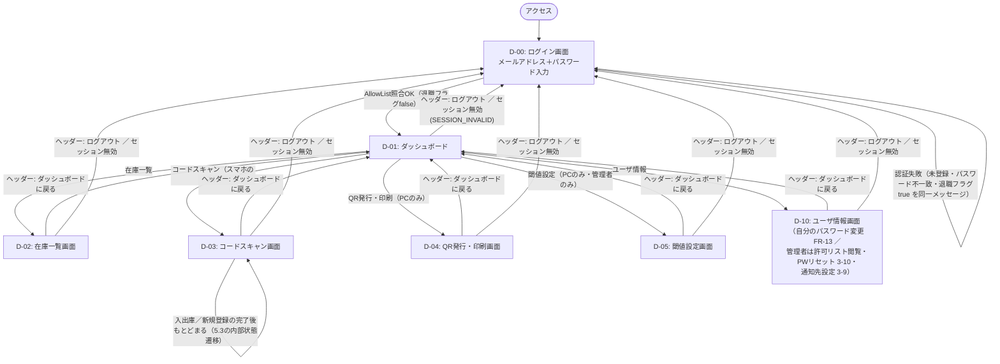

# 画面設計

- 対象システム：整備部品在庫管理システムv2
- 本書の位置付け：画面遷移の詳細設計
- 対応する画面一覧：要件定義書 8章（D-00〜D-06、D-10）
  - D-06（ローディング表示）は画面処理中に重ねるオーバーレイであり、遷移先を持たない。以降の遷移図・遷移表では扱わない。
  - D-10（ユーザ情報画面）は、一般ユーザは自分のパスワード変更（FR-13）。管理者は加えて、許可リスト（一般ユーザのメールアドレス一覧）の閲覧と、対象ユーザのパスワードのリセット（再設定）ができる（3-10）。パスワードは bcrypt ハッシュで保持するため平文表示はしない。ユーザ行の追加・削除は DB の直接編集（要件10章）。さらに管理者は、通知先設定（在庫アラートメールの送信先メールアドレスの追加・削除）ができる（3-9、FR-09）。
  - D-02（在庫一覧画面）は、管理者のみ時差更新ボタンを表示する（蓄積データがある場合に活性化。3-12、FR-15）。

> **アーキテクチャ前提（[overview.md](overview.md) と共通）**
> 全画面を **単一の Nuxt4 アプリ（Vue3 / TypeScript）** として Cloud Run 上で提供する。
> 旧構成（GAS Web App ＋ 外部ホスティングの2ドメイン、URLパラメータでのトークン受け渡し）は用いない。
> 認証状態はセッションID（`x-session-id` ヘッダ）で各APIに引き継ぎ、クライアントは Nuxt の状態管理（`useAuth` / `useState`）で保持する（overview.md 4.1 / 6.3）。

---

## 1. 画面遷移図

各画面ヘッダーの共通導線（「ダッシュボードに戻る」「ログアウト」）と、API がセッション無効（`SESSION_INVALID`）を返した際の D-00 への強制遷移を含めた、確定版の遷移図を以下に示す。共通導線の詳細は2章を参照。

## 2. 画面共通要素

D-01〜D-10 の各画面ヘッダーに、以下の共通導線を配置する（遷移図は1章に統合済み）。

| 要素 | 表示画面 | 遷移先・処理 | 備考 |
|---|---|---|---|
| ダッシュボードに戻るリンク | D-02, D-03, D-04, D-05, D-10 | D-01 | - |
| ログアウトボタン | D-01〜D-10（共通ヘッダー） | D-00 | `POST /api/auth/logout` でサーバ側セッションを破棄し、クライアントは `useAuth`（`useState`）の保持値をクリアする（3-3、破棄漏れに注意） |
| ローディング表示（D-06） | 全画面 | 遷移なし（オーバーレイ） | 画面処理中に重ねて表示し、処理完了で解除する |

- 未ログイン状態で D-01 以降のパスへ直接アクセスした場合は、`src/app/middleware/auth.ts` が D-00 へリダイレクトする。
- 業務API がセッション無効（`code: SESSION_INVALID`）を返した場合、クライアントは操作画面を問わず D-00 へ強制遷移し、保持中のセッション情報をクリアする（overview.md 4.1 / 5章）。

## 3. 画面別・端末対応と遷移条件

- **端末判定は User-Agent で行う**（`src/app/utils/device.ts`）。`navigator.userAgent` が `Mobi` / `Android` / `iPhone` / `iPod` を含めば「スマホ」、それ以外は「PC」とする（iPadOS 13+ の Safari はデスクトップ UA を返すため「PC」扱いになるが、iPad の利用予定はないため問題ない。現場スキャンは iPhone / Android を想定）。判定は D-01 ダッシュボードの導線出し分けとページ側のガードに使う。サーバ側は端末を問わない（PC から `POST /api/scan` を呼んでも害はない）。

| 画面 | 端末 | 遷移元 | 遷移条件・備考 |
|---|---|---|---|
| D-00 | スマホ／PC | 初回アクセス／各画面のログアウト・セッション無効 | AllowList 照合（bcryptjs）。未登録・パスワード不一致・退職フラグtrue は同一メッセージで拒否（FR-01、`AUTH_FAILED`） |
| D-01 | スマホ／PC | D-00 認証成功後／各画面ヘッダーの「戻る」 | セッション保持中は再ログイン不要（トップ画面として都度戻る） |
| D-02 | スマホ／PC | D-01 | 品目ID・品目名・現在在庫数・閾値を表示。廃番品目は論理削除表示（一覧から非表示 or グレーアウト）。管理者権限ユーザのみ、蓄積データがある場合は時差更新ボタンを活性化（`POST /api/deferred-sync`、3-12）。導線の出し分けはクライアント側だが、APIはサーバ側でも管理者判定（非管理者は `PERMISSION_DENIED`） |
| D-03 | スマホのみ | D-01 | PC では導線を非表示。単一ページ内で状態遷移する（5.3）。カメラ利用のため HTTPS 必須・通常ブラウザ限定 |
| D-04 | PC のみ | D-01 | スマホでは導線を非表示 |
| D-05 | PC のみ | D-01 | 管理者権限ユーザのみ導線を表示（スマホ・非管理者では非表示）。導線の出し分けはクライアント側だが、各管理者APIはサーバ側でも管理者判定（非管理者は `PERMISSION_DENIED`） |
| D-10 | スマホ／PC | D-01 | 一般ユーザ：自分のパスワード変更（`PUT /api/user/password`、FR-13）。管理者：加えて許可リスト（一般ユーザのメールアドレス一覧）の閲覧（`GET /api/users`）と対象ユーザのパスワードのリセット（`PUT /api/users/{allowId}/password`）（3-10）、通知先メールアドレスの追加・削除（`GET/POST/DELETE /api/notification-targets`、3-9）。パスワードは bcrypt ハッシュ保持のため平文表示はしない。ユーザ行の追加・削除は DB（スプレッドシート）の直接編集で行う（要件10章） |

## 4. 画面ごとの実装先

全画面を単一の Nuxt4 アプリ（`src/`）としてビルドし、Cloud Run（`max-instances=1`）にデプロイする。各画面は `src/app/pages/` 配下の1ファイルに対応する（overview.md 2.2）。

| 画面 | ルーティング（`src/app/pages/`） | ホスティング | 備考 |
|---|---|---|---|
| D-00 | `index.vue` | Cloud Run（Nuxt4 / Nitro） | 未ログイン時は `middleware/auth.ts` で本画面へリダイレクト |
| D-01 | `dashboard.vue` | 同上 | 初期表示画面 |
| D-02 | `list.vue` | 同上 | 管理者のみ時差更新ボタンを含む |
| D-03 | `inport_qr.vue` | 同上 | スマホのみ |
| D-04 | `export_qr.vue` | 同上 | PC のみ |
| D-05 | `threshold.vue` | 同上 | PC のみ・管理者 |
| D-10 | `user_info.vue` | 同上 | 管理者のみ通知先設定を含む |

## 5. 画面ごとの主な入出力（実装時チェックリスト）

- すべての業務APIは `x-session-id` ヘッダを付与し、API層で `validateSession` を通す。`code: SESSION_INVALID` を受けたら D-00 へ強制遷移（2章、overview.md 4.1）。
- 操作者（メールアドレス）はサーバがセッションから解決するため、クライアントからは送らない（FR-06 / FR-07）。
- 管理者専用API（閾値・廃番・通知先・時差更新・許可リスト閲覧・パスワードリセット）はサーバ側でも管理者判定を行う。非管理者の呼び出しは `code: PERMISSION_DENIED`（D-02 の管理者専用ボタン・D-05 の導線・D-10 の管理者機能は元々非管理者に非表示のため通常は発生しない。overview.md 4.1 / 5章）。
- リクエスト／レスポンスのボディ構造・入力バリデーションは [overview.md](overview.md) 4.6、エンドポイントの詳細は同 4.2、エラーコードは同 5章を参照。

### 5.1. 画面別 入出力一覧

| 画面 | 主な入力 | 主な出力・表示 | 呼び出すAPI |
|---|---|---|---|
| D-00 ログイン | メールアドレス、パスワード | 認証失敗時は同一メッセージ（`AUTH_FAILED`、列挙攻撃対策）。成功時は D-01 へ遷移 | `POST /api/auth/login` |
| D-01 ダッシュボード | 各画面への遷移操作 | ログイン中ユーザ表示、D-02〜D-05 / D-10 への導線（端末・管理者権限で出し分け）、共通ヘッダー（戻る／ログアウト） | `GET /api/auth/user`（セッション検証・期限延長）、`POST /api/auth/logout` |
| D-02 在庫一覧 | （閲覧のみ。絞り込み・並べ替えは任意）／管理者：時差更新ボタン押下 | 品目ID・品目名・現在在庫数・閾値の一覧。廃番品目は非表示 or グレーアウト（FR-02、FR-11）／管理者：時差更新ボタン（`pending/` に蓄積データがある場合のみ活性、3-12） | `GET /api/inventory`／管理者：`POST /api/deferred-sync` |
| D-03 コードスキャン | カメラ映像（QR / JAN / GS1 DataMatrix）、入出庫種別（IN / OUT）、数量、未登録時は品目名・閾値・保管場所 | 読み取った itemId（自社発行QR）または GTIN（JAN/GS1）で検索した結果の itemId・品目名・現在在庫数、状態遷移（5.3）、入出庫・登録の完了／エラー表示。新規登録直後は IN のみ許可。出庫数量が現在在庫数を超える場合は `INSUFFICIENT_STOCK` を確認画面に表示（在庫は更新されない） | `GET /api/inventory/{itemIdまたはgtin}`、`POST /api/scan` |
| D-04 QR発行・印刷 | 新規品目情報（品目名・閾値・保管場所）または一覧からの既存品目選択、印刷レイアウト指定 | 品目ID（`ITM-xxxxxx`）をエンコードした QRコード、ラベル印刷レイアウト（クライアント生成、`qrcode`）。**新規登録時は `POST /api/scan` のレスポンス `data.itemId` に採番された `ITM-xxxxxx` が返るので、その値で QR を生成する（採番前に印刷しない）** | 新規登録時のみ `POST /api/scan`（登録＋1点入庫に合流、サーバが `ITM-` を採番。`gtin` は送らない）／再発行は `GET /api/inventory` のみ（生成はクライアント、新規APIなし） |
| D-05 閾値設定（管理者） | 品目ごとの閾値、廃番フラグ | 在庫一覧＋閾値入力欄、廃番フラグ操作、更新結果 | `GET /api/inventory`、`PUT /api/threshold`、`PUT /api/inventory/{itemId}/discontinued` |
| D-10 ユーザ情報 | 自分の新パスワード（確認用に再入力）／管理者：対象ユーザ選択＋新パスワード（確認用に再入力）、通知先メールアドレスの追加・削除 | 更新結果メッセージ（bcryptjs 再ハッシュ）／管理者：許可リスト一覧（メールアドレス・管理者判定・退職フラグ。ハッシュは表示しない）、通知先設定の一覧（3-9） | `PUT /api/user/password`／管理者：`GET /api/users`、`PUT /api/users/{allowId}/password`、`GET/POST/DELETE /api/notification-targets` |

> 通知先設定（NotificationTargets）の管理UIは D-10（ユーザ情報画面、管理者のみ）に配置する（2026-09-11 確定。3-9、FR-09）。時差更新ボタンは D-02（在庫一覧画面、管理者のみ）に配置する（2026-09-11 確定。3-12、FR-15）。

### 5.2. QR再発行機能
- 既存品目（品目ID）を一覧から選択し、DBへの新規登録・更新を伴わずクライアント側でQRコードを再生成する機能
- QRコードは品目IDを直接エンコードしているため、サーバー側に新規APIを追加せず `GET /api/inventory` で取得済みの品目一覧から選択するだけで実現している（在庫マスタの itemId・itemName は不変のため、再生成しても内容は初回発行時と同一）

### 5.3. D-03内の画面状態（未登録品目の自動登録、FR-12）
D-03は単一ページ内で以下の状態を切り替える形で実装しており、画面遷移図（1章）上は同一ノード（D-03）内部の遷移として扱う。

| 状態 | 表示内容 | 遷移条件 |
|---|---|---|
| スキャン中 | カメラ映像 | 初期状態、または「スキャンに戻る」操作 |
| 確認画面 | 品目ID・品目名・現在在庫数、入出庫種別・数量入力 | `GET /api/inventory/{itemId}` が登録済み品目を返した場合。出庫で `INSUFFICIENT_STOCK` を受けた場合はこの画面にエラー表示（状態は遷移しない） |
| 新規登録画面 | 読み取ったコード、品目名・閾値・保管場所の入力欄 | `GET /api/inventory/{itemId}` が `code: "ITEM_NOT_FOUND"` を返した場合 |
| 完了画面 | 登録・入出庫完了メッセージ | `POST /api/scan` が成功した場合 |
| エラー画面 | エラーメッセージ、再試行／ログイン導線 | 通信失敗、セッション無効、`LOCK_TIMEOUT`（新規登録時）等 |

詳細シーケンスは `sequence.md` 2.5節を参照。
